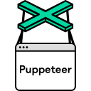
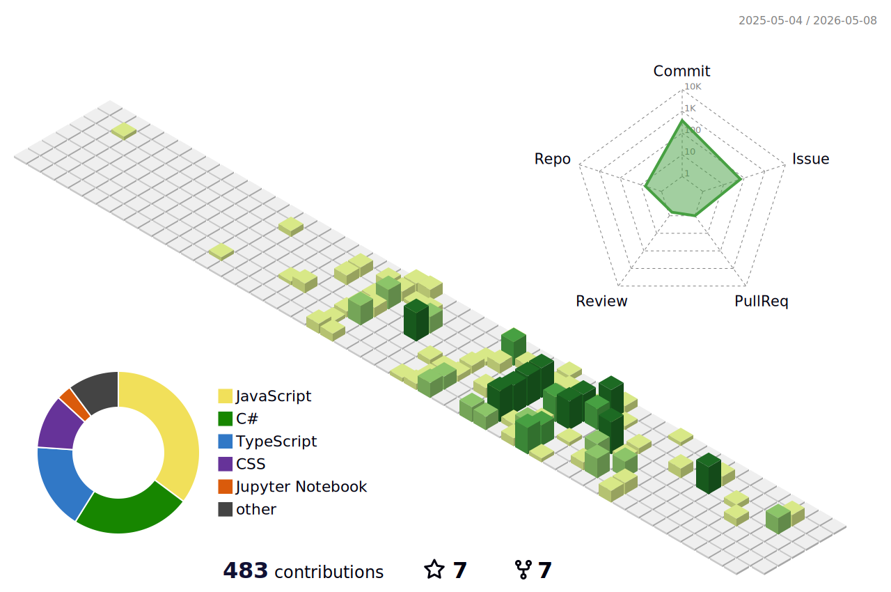

- 🔭 I’m currently working on [Opal Labs](https://github.com/AbdulDevHub/Opal-Labs-Frontend)
- 🌱 I’m currently learning **Next.js, Three.js, & SQL**
- 👨‍💻 All of my projects are available at [abdulhadikhan.vercel.app](https://abdulhadikhan.vercel.app/)

<h3 align="left">Connect with me:</h3>

  
  

<h3 align="left">Languages and Tools:</h3>

  <a href="https://aws.amazon.com/" target="_blank" rel="noreferrer">
    <picture>
      <source media="(prefers-color-scheme: dark)" srcset="Images/Dark%20Versions/AWS.png" />
      <source media="(prefers-color-scheme: light)" srcset="Images/AWS.svg" />
      
    </picture>
  </a>

  

  

  

  

  

  

  

  

  

  

  

  

  

  

  

  

  

  

  

  

  

  

  

  

  

  

  

  

  

  

  

  

  

  

  

  <a href="https://threejs.org/" target="_blank" rel="noreferrer">
    <picture>
      <source media="(prefers-color-scheme: dark)" srcset="Images/Dark%20Versions/Threejs.png" />
      <source media="(prefers-color-scheme: light)" srcset="Imaeges/Threejs.svg" />
      
    </picture>
  </a>

  

  <a href="https://unity.com/" target="_blank" rel="noreferrer">
    <picture>
      <source media="(prefers-color-scheme: dark)" srcset="Images/Dark%20Versions/Unity.png" />
      <source media="(prefers-color-scheme: light)" srcset="Images/Unity.svg" />
      
    </picture>
  </a>

  <a href="https://vercel.com/" target="_blank" rel="noreferrer">
    <picture>
      <source media="(prefers-color-scheme: dark)" srcset="Images/Dark%20Versions/Vercel.png" />
      <source media="(prefers-color-scheme: light)" srcset="Images/Vercel.svg" />
      
    </picture>
  </a>

  

  

  

<!-- Code To Render Stats -->

  <h2>GitHub Stats</h2>
  
  <picture>
    <source media="(prefers-color-scheme: dark)" srcset="https://readmeify-github-readme-stats.vercel.app/api/top-langs?username=abduldevhub&show_icons=true&locale=en&layout=compact&theme=dark">
    <source media="(prefers-color-scheme: light)" srcset="https://readmeify-github-readme-stats.vercel.app/api/top-langs?username=abduldevhub&show_icons=true&locale=en&layout=compact&theme=light">
    
  </picture>
  
  <picture>
    <source media="(prefers-color-scheme: dark)" srcset="https://readmeify-github-readme-stats.vercel.app/api?username=abduldevhub&show_icons=true&locale=en&theme=dark">
    <source media="(prefers-color-scheme: light)" srcset="https://readmeify-github-readme-stats.vercel.app/api?username=abduldevhub&show_icons=true&locale=en&theme=light">
    
  </picture>
  
  <picture>
    <source media="(prefers-color-scheme: dark)" srcset="https://readmeify-github-streak-stat.vercel.app/?user=abduldevhub&theme=dark">
    <source media="(prefers-color-scheme: light)" srcset="https://readmeify-github-streak-stat.vercel.app/?user=abduldevhub&theme=light">
    
  </picture>

<!-- Code To Render Snake GIF -->

  <h2>🐍 My Contributions 🐍</h2>
  
  <picture>
    <source media="(prefers-color-scheme: dark)" srcset="https://raw.githubusercontent.com/abduldevhub/abduldevhub/output/github-contribution-grid-snake-dark.svg" />
    <source media="(prefers-color-scheme: light)" srcset="https://raw.githubusercontent.com/abduldevhub/abduldevhub/output/github-contribution-grid-snake.svg" />
    
  </picture>
  
    

<!-- Code To Render 3D Commit Table -->
<picture>
  <source media="(prefers-color-scheme: dark)" srcset="https://readmeify-edit-svg-proxy.netlify.app/profile.svg" />
  <source media="(prefers-color-scheme: light)" srcset="./profile-3d-contrib/profile-green-animate.svg" />
  
</picture>
  
