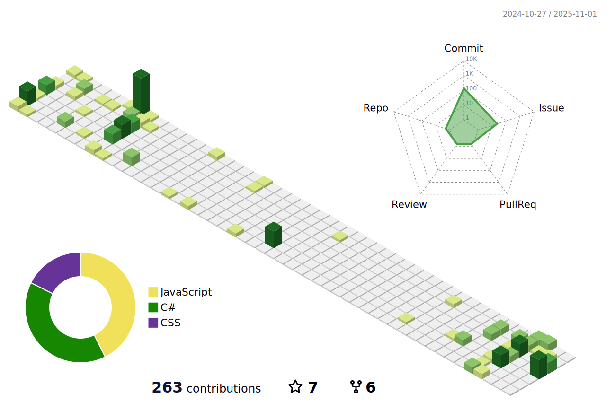

- 🔭 I’m currently working on [Next.js Productivity Website](https://github.com/AbdulDevHub/Opal-Labs-Frontend)
- 🌱 I’m currently learning **Next.js, Three.js, & SQL**
- 👨‍💻 All of my projects are available at [abdulhadikhan.netlify.app](https://abdulhadikhan.netlify.app/) and [abdulhadikhan.vercel.app](https://abdulhadikhan.vercel.app/)

<h3 align="left">Connect with me:</h3>

<h3 align="left">Languages and Tools:</h3>

  
  
  
    
  
    
  
    
  
    
  
  
  

  
    
  
    
  

  
    
  
    
  
    
  

  
    
  
  
  
    
  
  
  

  
  
  
    
  
    
  

  

  
    
  
    
  

  
    
  
    
  

<!-- Code To Render Stats -->

  <h2>GitHub Stats</h2>
  
  <picture>
    <source media="(prefers-color-scheme: dark)" srcset="https://github-readme-stats.vercel.app/api/top-langs?username=abduldevhub&show_icons=true&locale=en&layout=compact&theme=dark">
    <source media="(prefers-color-scheme: light)" srcset="https://github-readme-stats.vercel.app/api/top-langs?username=abduldevhub&show_icons=true&locale=en&layout=compact&theme=light">
    
  </picture>
  
  <picture>
    <source media="(prefers-color-scheme: dark)" srcset="https://github-readme-stats.vercel.app/api?username=abduldevhub&show_icons=true&locale=en&theme=dark">
    <source media="(prefers-color-scheme: light)" srcset="https://github-readme-stats.vercel.app/api?username=abduldevhub&show_icons=true&locale=en&theme=light">
    
  </picture>
  
  <picture>
    <source media="(prefers-color-scheme: dark)" srcset="https://github-readme-streak-stats.herokuapp.com/?user=abduldevhub&theme=dark">
    <source media="(prefers-color-scheme: light)" srcset="https://github-readme-streak-stats.herokuapp.com/?user=abduldevhub&theme=light">
    
  </picture>

<!-- Code To Render Snake GIF -->

  <h2>🐍 My Contributions 🐍</h2>
  
  <picture>
    <source media="(prefers-color-scheme: dark)" srcset="https://raw.githubusercontent.com/abduldevhub/abduldevhub/output/github-contribution-grid-snake-dark.svg" />
    <source media="(prefers-color-scheme: light)" srcset="https://raw.githubusercontent.com/abduldevhub/abduldevhub/output/github-contribution-grid-snake.svg" />
    
  </picture>
  
    

<!-- Code To Render 3D Commit Table -->
<picture>
  <source media="(prefers-color-scheme: dark)" srcset="./profile-3d-contrib/profile-night-green.svg" />
  <source media="(prefers-color-scheme: light)" srcset="./profile-3d-contrib/profile-green-animate.svg" />
  
</picture>
  
